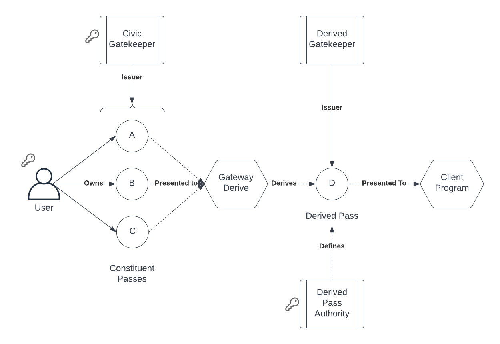

# Gateway Derive

An extension to the Identity.com [Gateway solution](https://github.com/identity-com/gateway-whitepaper/blob/main/gateway-whitepaper.pdf) that allows one pass type (a.k.a. gatekeeper network) to be derived from another.

## Summary

The core idea here is as follows:

- There is an equivalence between a Gatekeeper Network and a Pass Type. 
All passes issued from the same gatekeeper network are treated as equivalent during on-chain validation.
- It may be necessary to validate that a user has more than one pass.
For example, if one pass verifies that a user meets the requirement of being over 18, and another verifies
that they are not in a blocked country, then a smart contract may wish to verify that the user meets both requirements.
- No authority is necessary to issue a pass based *solely* on the possession of constituent passes.

This smart contract allows for the generation of _derived pass types_,
that are issued if a caller presents a wallet with active passes from each of the _constituent pass types_.

Derived Pass issuance is "self-serve" i.e. the recipient of the pass is the only signer needed.
This makes it ideal for integrating with dApps.



## Definitions

- A Derived Pass Type is a gatekeeper network, from the point of view of the Gateway Program, but unlike a standard
gatekeeper network, it is a [PDA](https://docs.solana.com/developing/programming-model/calling-between-programs#program-derived-addresses),
owned by the GatewayDerive program. 
- A Constituent Pass Type is a gatekeeper network. This can be a standard gatekeeper network, or a derived one.
- The gatekeeper for a derived pass is also a PDA, owned by the GatewayDerive program.
In essence, this means that the program is the gatekeeper for the derived pass, and is the only entity that can issue tokens on it.

## Fees

Constituent pass issuers can register a Fee for use of a constituent pass in a derived pass issuance.

Fees are paid from the derived pass recipient to the gatekeeper(s) that issued the constituent passes.
Fees are registered per gatekeeper network + gatekeeper.

Note: SOL only is supported at present, with plans to support SPL-Tokens in the future.

## Limitations

This program is limited in what it can do, and care should be taken that it is not used in a way that is not intended.

- After issuance, the validity of the derived pass type is *independent* of the validity of the constituent passes.
This means, a constituent pass can be revoked or frozen, and the derived pass will still be considered valid.
- The current implementation supports issue only, no refresh, freeze or revoke is possible.
The requirement to refresh would, in part, mitigate the above issue, in that a pass could be defined to be valid
for only as long as the constituent passes are valid.
- The current implementation supports "AND" only logic, when evaluating constituent passes.
A potential improvement would be to allow derived passes that contain "OR" or "NOT", logic, allowing for alternative
passes (in jurisdiction A OR in jurisdiction B, for example), or blacklists (does not possess token X).
- The current implementation does not allow for gateway extensions, such as expirable passes, as yet.

## Usage

This application uses [Anchor](https://github.com/project-serum/anchor).
To create an Anchor provider from a Solana wallet and connection, do the following:

```ts
import * as anchor from "@project-serum/anchor";
import { Connection } from "@solana/web3.js";

const connection = new Connection(...);

// If running locally via a script (most typical during derived pass creation),
// this can be obtained from a Keypair using:
const wallet = new anchor.Wallet(keypair);

// if using solana-wallet-adapter (e.g. during issuance on a dApp),
// this will be the wallet provided by the adapter
const wallet = useWallet();

const provider = new anchor.AnchorProvider({
  connection,
  wallet,
  opts: anchor.AnchorProvider.defaultOptions(),
});
```

### Create a new derived pass

The provider is an authority keypair, used once during creation of the derived pass.

```ts
import { DerivedPassService } from "@civic/solana-derived-pass";

const service = await DerivedPassService.build(provider);

const [txSignature, derivedPass] = await service.derivePass([
  new PublicKey("..."), // pass 1
  new PublicKey("..."), // pass 2
]);
```

Keep the authority public key, and derived pass public key, and add it to the dApp.

### Issuing a pass

```ts
import { DerivedPassService } from "@civic/solana-derived-pass";

const service = await DerivedPassService.build(provider);
const [txSignature, gatewayToken] = await service.issue(authority, derivedPass);
```

### Setting a fee

Create an anchor provider with the gatekeeper wallet.

```ts
import { DerivedPassService } from "@civic/solana-derived-pass";

const gatekeeperService = await DerivedPassService.build(provider);
const fee = 100_000_000 // 0.1 SOL 
const txSignature = await gatekeeperService.setFee(gatekeeperNetwork, fee);
```

Fees can be changed after being set:

```ts
const new_fee = 200_000_000 // 0.2 SOL 
const txSignature = await gatekeeperService.setFee(gatekeeperNetwork, fee);
```

or removed:

```ts
const txSignature = await gatekeeperService.unsetFee(gatekeeperNetwork);
```
